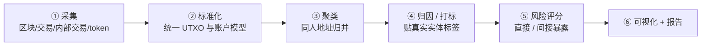

# 01 · 领域基础：资金链路追踪到底在做什么

## 结论

区块链上的每一笔交易都是**公开、永久、可查**的，但地址只是一串字符（假名），不直接对应真人。资金链路追踪引擎做的事，就是把「一堆公开的交易记录」组装成「谁和谁发生了资金往来」的一张图，再用**已知归属的地址（打标地址）**去推断图上那些**未知地址是谁**。

它回答四个问题：

1. 这笔钱（或这个地址的钱）**从哪来**？（上游追踪）
2. 这笔钱**到哪去**了？（下游追踪）
3. 中间**经过了谁**？（路径还原）
4. 路径上的这些地址**可能是什么身份**？（打标 / 归因）

---

## 一、用一句话建立直觉

把它想象成**查银行卡流水，但流水里全是"匿名卡号"**：

- 你知道「卡号 A 是某个诈骗团伙的收款卡」（这是**打标地址**）。
- 你要顺着 A 的转账记录，看它把钱转给了 B、B 又转给 C……最后 C 是把钱充值进了一家交易所（交易所要实名 KYC）。
- 一旦追到「交易所入金地址」，就能配合交易所调取实名信息，锁定真人。

链上追踪的难点在于：**中间路径可能是几十跳、几百个地址，钱还会拆分、合并、走合约、换币种、跨链**。引擎的价值就是把这种人工无法完成的遍历自动化，并给出可解释的结论。

---

## 二、核心术语（大白话版）

| 术语 | 普通话解释 | 工程上的类比 |
| --- | --- | --- |
| **地址 (Address)** | 链上的假名账户，一串 0x 开头的字符 | 银行「匿名卡号」 |
| **交易 (Transaction)** | 一笔顶层操作：谁在什么时间发起了什么 | 一条转账记录 |
| **转账 / 价值转移 (Transfer)** | 钱实际从 A 动到 B 的动作 | 流水的「借方/贷方」 |
| **内部交易 (Internal Transaction)** | 一笔顶层交易执行合约时，合约内部产生的 ETH 转账；它没有独立的用户交易入口，但有父交易哈希和调用层级 | 你调用付款程序，程序再替你把 ETH 转给 C；这笔 ETH 流动属于父交易的执行结果 |
| **Token 转账 (ERC-20/721)** | 非原生币（USDT、NFT 等）的转移 | 账户里的「美元」「黄金」等非本币资产变动 |
| **打标 / 标签 (Tagging / Label)** | 给地址贴标签：交易所、混币器、钓鱼、黑客、制裁 | 给匿名卡号备注「疑似诈骗」 |
| **归因 / 归属 (Attribution)** | 判断某个地址背后是哪个真实实体 | 找到匿名卡号的持卡人 |
| **实体聚类 (Clustering)** | 把属于同一个人的多个地址归并成一个「实体」 | 发现 10 张匿名卡其实是同一个人开的 |
| **污点分析 (Taint Analysis)** | 追踪「脏钱」如何在图里扩散、稀释 | 追踪一张假钞在市场上流转后还剩下多少"污点" |
| **找零地址 (Change Address)** | （主要是比特币）转账后找回给自己的那笔钱的新地址 | 你付 100 买 60 的东西，找回 40 进的是你自己的另一个口袋 |
| **剥链 (Peeling Chain)** | 大额资金一层层「剥皮」：每跳只转走一小笔，剩余大头继续往下滚 | 把一个整钱反复拆成零钱，制造大量中间跳数来迷惑追踪 |

### 需要特别强调的一个点（容易混淆，面试常考）

**「找零地址」「共同输入」这类启发式，本质是比特币 UTXO 模型的概念，不能直接照搬到以太坊。**

- 比特币是 **UTXO 模型**：一笔交易有多个「输入」和多个「输出」，天然适合「共同输入归属」「找零地址」这类启发式。
- 以太坊是 **账户模型**：一个地址就是一个账户，没有「输入/输出」这种结构。所以以太坊的聚类靠的是别的信号（见下表）。

| | 比特币 (UTXO) | 以太坊 (账户模型) |
| --- | --- | --- |
| 核心启发式 | 共同输入、找零地址、剥链、地址复用 | 入金地址聚类、资金扇出（fan-out）、时间/手续费相关性、重复合约交互 |
| 打标难度 | 相对成熟 | 合约参与多，更复杂 |

> 面试时如果面试官问「以太坊怎么聚类地址」，答「跟比特币一样的找零地址」是**错的**。正确思路见 `02-引擎功能设计.md` 的「打标层 → 聚类启发式」。

---

## 三、完整工作流（六大步）

同类头部厂商（Chainalysis / Elliptic / TRM）公开描述的通用流程是一致的：

1. **采集** —— 跑节点 / 调 API，把区块、交易、内部交易、token 转账数据抓下来。
2. **标准化** —— 把不同链、不同格式的数据统一成一种结构（尤其要统一「UTXO 模型」和「账户模型」的差异）。
3. **聚类** —— 用启发式把「可能同属一人」的地址归并。
4. **归因 / 打标** —— 给聚类和地址贴真实实体标签（来源：公开披露、交易所自报、执法数据、制裁名单、链上行为）。
5. **风险评分** —— 结合「直接暴露」和「间接暴露」给地址/交易打分。
6. **可视化 + 报告** —— 把结论画成图、写成可上庭/可审计的报告。

---

## 四、同类产品对标（事实，来源：各官方站点与公开对比资料，2025–2026）

| 能力维度 | Chainalysis | Elliptic | TRM Labs |
| --- | --- | --- | --- |
| 主打 | 归因数据库最全 + 法庭可采信 | 跨链能力最强 + DeFi 覆盖 | 实时性最快 + AI 辅助 |
| 归因规模 | 13.4 万+实体、10 亿+地址已聚类 | 100+ 链、约 99% 市值覆盖 | 100+ 链、45+ 链实时索引 |
| 特色产品 | Reactor（可视化）、KYT（监控） | Navigator/Investigator | 风险评分 + Transfer Labels |
| 置信度表达 | 偏二值聚类 + 人工复核 | 多因子聚类 | 数值化置信度，可设阈值过滤 |

**对个人开发者系统的启示**：头部厂商的护城河主要是**「归因数据库的规模与质量」**，而不是追踪算法本身。个人版本无法复刻数据库，所以要把发力点放在：

- **追踪算法做得干净、可解释**（BFS/DFS、深度控制、扇出裁剪、污点传播）；
- **打标逻辑做得可解释、带置信度**（哪怕是规则 + 简单权重）；
- **验证一个完整的「数据采集 → 追踪 → 打标 → 风险分析」闭环**。

---

## 五、关键难点（面试要能主动说出来的）

1. **扇出/扇入爆炸**：交易所热钱包有百万级对手方，盲目遍历会瞬间爆炸。需要深度限制 + Top-N 按金额裁剪 + 把「基础设施地址」当终点。
2. **内部交易缺失**：不抓内部交易，等于漏掉绝大部分经合约（混币器、DEX、桥）的流动。
3. **换形态**：ETH 换成 USDT、再跨链，价值还在但技术路径断了，跨链/跨币追踪是难点。
4. **混币器（如 Tornado Cash）**：把多人的钱混在一起再分出，污点分析会失效或产生大量假阳性。
5. **假阳性 vs 漏报**：普通人可能只是「几跳之外」和坏地址有间接往来，不代表有问题。引擎必须给置信度，而不是非黑即白。

---

## 小结

- 追踪引擎 = **图构建 + 图遍历 + 打标 + 置信度**。
- 以太坊追踪必须覆盖**内部交易**，聚类不能用比特币那套 UTXO 启发式硬套。
- 个人开发者版本的重点是**追踪/打标/风险分析的可解释性**和数据复用能力，不是去比谁的地址库大。
