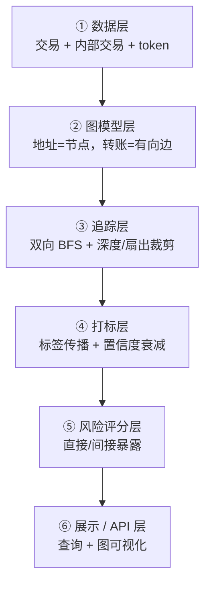
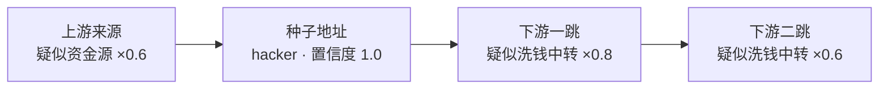

# 02 · 引擎功能设计：一个合格的链路追踪引擎需要哪些 feature

## 结论

一个合格的资金链路追踪引擎，不是「一个查询接口」或「一张图」，而是 **六层能力**：

> **数据层 → 图模型层 → 追踪层 → 打标层 → 风险评分层 → 展示/API 层**，外加一层贯穿全程的**非功能要求**。

面试时能把这个分层说出来，并讲清每一层的关键 feature 和取舍，就说明你不只是「调了个 API 查转账记录」。

下面每层列出 feature，并标注它在**第一阶段中的优先级**（必须 / 建议 / 后续）。

---

## 第一层：数据层（Data Ingestion）

**目标**：把链上原始数据变成可查询的、带索引的记录。

| Feature | 说明 | Demo 优先级 |
| --- | --- | --- |
| 区块/交易采集 | 抓取普通交易（from/to/value/gas/time） | 必须 |
| **内部交易采集** | 抓合约执行中的价值转移（`txlistinternal`），漏了它等于漏掉大半流动 | 必须 |
| Token 转账采集 | ERC-20 转账（USDT 等） | **必须** |
| NFT 转账采集 | ERC-721 / 1155 | 后续 |
| 地址索引 | `address -> 相关交易列表` 的索引，加速查询 | 必须 |
| 多数据源适配 | Etherscan API / 公共 RPC / BigQuery / ethereum-etl，可切换 | 建议 |
| 增量同步 | 只同步新区块，避免全量重扫 | 加分 |

**数据源对比（事实，2025–2026）**：

| 数据源 | 优点 | 缺点 | 适合 |
| --- | --- | --- | --- |
| Etherscan 免费 API | 已建好索引、开箱即用 | 限流约 3–5 req/s、10 万次/天 | **Demo 首选** |
| 公共 RPC（Infura/Alchemy 免费档） | 原始数据全 | 无索引，要自己扫区块，慢 | 需要链上实时数据时 |
| BigQuery 公共数据集 | 全量历史、批量分析快 | 需要 GCP 账号、有学习成本 | 批量/规模分析 |
| ethereum-etl（开源） | 可落库成自己的数据 | 要自建存储和管道 | 想展示「自建数据管道」 |

> 关键判断：**Demo 用 Etherscan API 最快出成果**；如果面试想展示工程能力，再加「用 ethereum-etl + 自建库」作为亮点。

---

## 第二层：图模型层（Graph Model）

**目标**：把「转账记录」抽象成「有向图」。

| Feature | 说明 | Demo 优先级 |
| --- | --- | --- |
| 节点 = 地址/合约 | 每个地址一个节点（含是普通地址还是合约的标记） | 必须 |
| 边 = 价值转移 | 有方向（from→to）、金额、时间、交易哈希、币种 | 必须 |
| 入边/出边邻接表 | 支持「往上找来源」和「往下找去向」两种遍历 | 必须 |
| 多币种建模 | 同一边标注是 ETH 还是某 token | 建议 |
| 多链建模 | 跨链时把「桥」当作跨链边 | 加分 |
| 存储选型 | 内存邻接表（demo）/ 图数据库 Neo4j 等（生产） | 内存即可 |

**存储选型判断**：

| 方案 | 优点 | 缺点 | 结论 |
| --- | --- | --- | --- |
| 内存邻接表（map） | 简单、快、零依赖 | 数据量受限、不能持久化 | **Demo 用这个** |
| Neo4j 等图数据库 | 原生图查询（Cypher）、能存大规模 | 部署重、面试现场难展示 | 生产再上 |
| 关系库 + 递归 CTE | 复用已有 SQL 技能 | 多跳递归性能差、图语义弱 | 不推荐做核心 |

---

## 第三层：追踪层（Tracing）—— 核心

**目标**：给定种子地址，还原资金路径。

| Feature | 说明 | Demo 优先级 |
| --- | --- | --- |
| 上游追踪 (Backward) | 沿入边往回走，回答「钱从哪来」 | 必须 |
| 下游追踪 (Forward) | 沿出边往前走，回答「钱到哪去」 | 必须 |
| 双向追踪 | 同时上下行，还原完整链路 | 必须 |
| 多跳深度控制 | 限制最大跳数（默认 3–5 跳） | 必须 |
| **扇出/扇入裁剪** | 每跳只保留 Top-N（按金额），防爆炸 | 必须 |
| 基础设施终点识别 | 遇到交易所/知名合约时标记为「终点」，不再深入 | 必须 |
| 找零地址识别 | 识别「大头继续走、小头是支付」的剥链模式 | 建议 |
| 剥链识别 | 检测 95–99% 价值持续向前的链式转移 | 建议 |
| 金额阈值过滤 | 过滤粉尘交易（dust）噪声 | 建议 |
| **污点传播与衰减** | 计算「脏钱占比」，并随跳数衰减 | 必须（打标的前提） |

### 追踪层的核心难点：扇出爆炸

- 一个普通地址一跳可能只有几个对手方；但一个**交易所热钱包**可能有百万对手方。
- 解决：**深度限制 + 每跳 Top-N 金额裁剪 + 把已知「基础设施/交易所/合约」当成终点不再深入**。
- 面试话术：「我用 BFS 做双向遍历，配深度上限和按金额的 Top-N 裁剪，同时对已打标的交易所/合约地址做剪枝，把遍历复杂度控制在可控范围。」

---

## 第四层：打标层（Tagging / Attribution）—— 核心

**目标**：给地址贴「它可能是谁」的标签，并说明「多可信」。

| Feature | 说明 | Demo 优先级 |
| --- | --- | --- |
| 标签体系 (Taxonomy) | 定义标签类型：交易所/混币器/桥/钓鱼/黑客/制裁/DeFi 协议等 + 风险等级 | 必须 |
| 标签来源 | 公开数据集、OFAC 制裁名单、交易所自报、人工、启发式推断 | 必须 |
| **标签传播规则** | 由已知标签沿链路推断未知地址（例：黑客下游 1 跳 = 「疑似洗钱中转」） | 必须 |
| **置信度模型** | 每个标签带 0–1 置信度，并衰减（跳数越远越不可信） | 必须 |
| 标签审计链 | 记录每个标签的「来源 + 时间 + 置信度」，可追溯 | 建议 |
| 聚类启发式（EVM） | 入金地址聚类、资金扇出、时间/手续费相关性 | 加分 |

### 标签传播 + 置信度（Demo 的核心逻辑，具体伪代码见 04）

核心思想：

1. 种子地址有确定标签（如 `hacker`, 置信度 1.0）。
2. 它**直接**转账的对象，推断为 `hacker 下游中转`，置信度打折扣（如 ×0.8）。
3. 再往下一跳继续衰减（×0.6……），直到低于阈值就停止打标。
4. 反向同理：上游来源可推断 `hacker 上游资金源`。
5. 若地址**命中多个标签来源**，置信度可以**累加或取最大**（规则要明确）。

传播方向示意（种子在中间，向上下游两个方向传播，置信度逐跳衰减）：

### EVM 聚类启发式（区别于比特币）

| 启发式 | 原理 | 信号强度 |
| --- | --- | --- |
| 入金地址聚类 | 交易所给每个用户一个入金地址，最后都归集到少数热钱包 → 这些入金地址同属交易所 | 高 |
| 资金扇出 (Funding fan-out) | 一个地址给一批「全新地址」各转一笔种子资金 → 大概率同属一人 | 高 |
| 时间/手续费相关性 | 多个地址在相近时间用相似 gas 价格发交易 | 中 |
| 重复合约交互 | 多个地址频繁和同一批合约交互 | 中 |

---

## 第五层：风险评分层（Risk Scoring）

| Feature | 说明 | Demo 优先级 |
| --- | --- | --- |
| 直接暴露 | 与坏地址有**直接**交易 → 高风险 | 建议 |
| 间接暴露 (N 度) | 资金几跳之外经过坏地址 → 按距离降权 | 建议 |
| 复合风险分 | 综合标签风险、暴露程度、金额、频率输出 0–100 | 加分 |
| 可解释性 | 说明「为什么这个地址被判定高风险」 | 加分 |

> 关键点：**间接暴露 ≠ 有问题**。一个普通用户可能只是几跳之外和坏地址有间接往来。风险评分必须**可解释、带置信度**，这是头部厂商反复强调的「假阳性」问题。

---

## 第六层：展示 / API 层（Presentation）

| Feature | 说明 | Demo 优先级 |
| --- | --- | --- |
| 查询 API | `GET /trace?address=0x..&direction=both&depth=3` → 返回图 + 标签 + 风险 | 必须 |
| 流向图可视化 | 前端画有向图，坏地址标红、交易所标蓝、按置信度着色 | 建议 |
| 报告导出 | 生成结构化报告（路径 + 标签 + 依据） | 加分 |

---

## 非功能要求（贯穿全程）

| 要求 | 说明 |
| --- | --- |
| **可解释性** | 每个标签、每条路径都要能回答「为什么」，而非黑盒 |
| **审计性** | 标签要有来源/时间/置信度，结论可复现（法庭采信的前提） |
| 性能 | 图遍历复杂度可控（深度 + 裁剪） |
| 可观测性 | 日志记录每次追踪的输入/参数/耗时 |
| 合规边界 | 明确「这是线索不是判决」，需线下证据（KYC/交易所）交叉验证 |

---

## 面试话术模板（结论先行）

> 「我把追踪引擎拆成六层：数据采集（重点覆盖内部交易）、图建模（地址为节点、资金流为有向边）、追踪（双向 BFS + 深度限制 + 扇出裁剪 + 污点传播）、打标（标签体系 + 传播规则 + 置信度衰减）、风险评分（直接/间接暴露 + 可解释）、展示（API + 图可视化）。其中追踪和打标是核心，难点是扇出爆炸和假阳性控制。」
