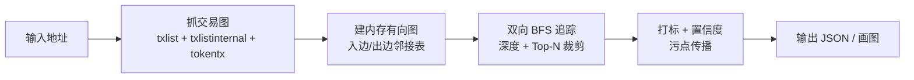

# 04 · 实现方案（MVP 边界 + 技术栈 + 核心算法）

## 结论

系统的最小闭环是：**给定一个地址 → 补齐 ETH、内部交易和 ERC-20 转账 → 构建多资产资金图 → 双向 BFS 追踪 → 按固定规则打标 + 置信度 → 计算风险 → 输出 JSON**。



技术栈定为 **Go + Echo + MongoDB + Etherscan API**。MongoDB 通过 Docker 本地运行；追踪时从 Mongo 加载必要数据构建内存邻接表。数据模型保留 `chain` 字段，第一阶段固定为 `ethereum`。

---

## 一、MVP 边界（明确做与不做）

**做：**
- 抓取种子地址及其邻居的普通交易、内部交易和 ERC-20 转账。
- 构建带资产维度的内存有向图（入边/出边邻接表）。
- 双向多跳追踪（深度 3–5，扇出 Top-N 裁剪）。
- 内置一批已知标签 + 手动加标签。
- 规则式标签传播 + 置信度衰减。
- HTTP 接口输出追踪结果 JSON。

**第一阶段不做：**
- NFT / 跨链追踪（二期）。
- 实时监控和自动告警。
- 图数据库、机器学习聚类。

---

## 二、技术栈

| 组件 | 选型 | 理由 |
| --- | --- | --- |
| 后端 | Go 1.24+ + Echo | 提供 HTTP 路由、中间件和请求生命周期管理 |
| 数据源 | Etherscan API（`txlist` + `txlistinternal` + `tokentx`） | 免费、已建索引 |
| 持久化 | MongoDB（Docker） | 缓存标准化交易、同步状态和标签来源 |
| 图存储 | 查询后的内存 `map[string]` 邻接表 | 追踪算法简单，避免过早引入图数据库 |
| 可视化 | 静态 HTML + ECharts/vis.js（可选二期） | 一期先用 JSON 就能演示 |
| 标签数据 | MongoDB 标签记录 + 初始化数据 | 可审计、可更新 |

---

## 三、业务闭环：追踪、打标与风险判断

这三个概念是连续但不同的步骤：

1. **追踪**：回答资金从哪里来、流向哪里，产出节点、边、路径和跳数。
2. **打标**：给地址附加身份或行为标签。确定性标签来自人工或公开名单；链路上的推断标签来自传播规则，必须带置信度和依据。
3. **风险判断**：综合地址本身的标签、与高风险地址的直接或间接暴露、路径距离、金额和规则置信度，产出风险等级与解释。

后续再次输入一个地址时，系统先检查本地是否已有该地址和相关邻居的数据；缺失则从 Etherscan 补齐，再执行追踪、标签匹配和风险计算。结果区分已知高风险、疑似关联和暂无结论，不能把数据不足当成安全。

风险评分是分析线索，不是对地址所有者的事实认定；每个分数都应能回溯到标签来源、交易和路径。

## 四、数据结构设计（Go）

```go
// 一条资金流动（有向边）
type Edge struct {
    From      string    // 转出地址
    To        string    // 转入地址
    Amount    string    // ETH 金额（wei，用 string 避免溢出；token 边为空）
    BlockTime int64     // 区块时间戳
    TxHash    string    // 顶层交易哈希（内部交易用其父交易哈希）
    IsInternal bool     // 是否为内部交易
    Asset     string    // "ETH" 或 ERC-20 合约地址
    Symbol    string    // 例如 USDT
    Decimals  uint8     // ERC-20 精度
    TokenValue string   // 原始 token 数量；ETH 边为空
    LogIndex   int64    // ERC-20 Transfer 日志索引；ETH 边为 -1
}

// 图：入边（谁转给我）+ 出边（我转给谁）
type Graph struct {
    In  map[string][]Edge  // 地址 -> 所有"转入该地址"的边（上游用）
    Out map[string][]Edge  // 地址 -> 所有"该地址转出"的边（下游用）
}

// 标签
type Label struct {
    Type       string   // hacker / phishing / exchange / mixer / intermediary ...
    Risk       string   // high / medium / low
    Confidence float64  // 0.0 ~ 1.0
    Source     string   // manual / propagation / public-list
}

// 追踪结果：一个节点在路径上的状态
type TraceNode struct {
    Address     string
    Labels      []Label
    Depth       int      // 距种子地址的跳数
    Direction   string   // upstream / downstream
}

// 最终返回
type TraceResult struct {
    Seed      string
    Nodes     []TraceNode
    Edges     []Edge
}
```

---

## 五、核心算法伪代码

### 5.0 ETH 与 ERC-20 的换币处理

ETH 和 ERC-20 是不同资产，不能直接把金额相加。一次 DEX 换币通常会产生同一个父交易下的多条事实：用户把 ETH 转入合约、合约把 Token 转给用户，或反方向发生。系统应：

- 分别保存 ETH 边和 ERC-20 边，边上携带 `Asset`、数量和精度；
- 追踪时默认按资产类型过滤，或由请求参数指定 `asset=ETH` / `asset=token` / `asset=all`；
- 当同一父交易同时出现不同资产的进出边时，记录一个“资产转换关联”，说明发生过换币，但不假设 ETH 与 Token 的金额可以直接比较；
- 如果没有 token 转账数据，只能追到合约入口，结果必须标记为“资产转换后数据不足”，不能当成资金终止。

第一阶段先做事实级关联和多资产路径展示，不做汇率换算和跨资产污点合并；风险规则可以分别计算 ETH 暴露和 Token 暴露。

### 5.1 双向追踪（BFS + 深度限制 + 扇出裁剪）

```go
func Trace(g *Graph, seed string, depth, topN int) TraceResult {
    // 两个方向分别 BFS
    upstream := bfs(g.In,  seed, depth, topN)   // 沿入边往回（钱从哪来）
    downstream := bfs(g.Out, seed, depth, topN) // 沿出边往前（钱到哪去）

    // 合并节点与边，去重
    return merge(upstream, downstream)
}

func bfs(adj map[string][]Edge, start string, depth, topN int) []TraceNode {
    visited := map[string]int{start: 0}  // 地址 -> 到达它的跳数
    queue := []string{start}
    var result []TraceNode

    for len(queue) > 0 && len(result) < maxNodes {
        cur := queue[0]; queue = queue[1:]
        d := visited[cur]

        // 剪枝 1：超过深度不继续
        if d >= depth { continue }

        // 剪枝 2：已打标为"基础设施/交易所/合约"的，标记为终点，不深入
        if isInfrastructure(cur) { continue }

        neighbors := adj[cur]
        // 剪枝 3：按金额取 Top-N，防止扇出爆炸
        neighbors = topNByAmount(neighbors, topN)

        for _, e := range neighbors {
            if _, seen := visited[e.To]; !seen {
                visited[e.To] = d + 1
                queue = append(queue, e.To)
                result = append(result, TraceNode{Address: e.To, Depth: d + 1})
            }
        }
    }
    return result
}
```

### 5.2 污点传播（脏钱占比 + 衰减）

```go
// taint[addr] = 该地址来自"脏源"的资金占比（0~1）
func PropagateTaint(g *Graph, seed string, depth int) map[string]float64 {
    taint := map[string]float64{seed: 1.0}   // 种子地址 100% 脏

    // 从 seed 沿下游（出边）扩散
    // 简化模型：A 转 X 给 B，则 B 的 taint += (A 的 taint) * (X / B 的总流入)
    // 实际实现按 BFS 逐层计算，每跳乘一个衰减系数
    ...
    return taint
}
```

> 说明：污点传播的精确模型是「B 的脏钱占比 = Σ(每个上游的 taint × 该笔金额) / B 的总流入」。Demo 可以简化为「每跳 ×0.7 衰减」，但要能在面试中讲清精确模型和简化模型的关系。

### 5.3 打标 + 置信度（规则传播）

```go
func PropagateLabels(g *Graph, seed string, seedLabel Label, depth int) []TraceNode {
    // 1. 下游打标：seed 直接/间接转出的地址 -> "疑似洗钱中转"
    //    置信度 = seedLabel.Confidence * decay^跳数（如 0.8^n）
    // 2. 上游打标：seed 的直接/间接来源 -> "疑似上游资金源"
    // 3. 命中多个规则时，置信度取最大值或按规则累加（规则要固定）
    // 4. 低于阈值（如 0.3）则不打标
    ...
}
```

**标签传播规则表（Demo 内置，明确、可解释）：**

| 种子标签 | 方向 | 推断标签 | 置信度衰减 |
| --- | --- | --- | --- |
| hacker / phishing | 下游 | 疑似洗钱中转 | 0.8^n |
| hacker / phishing | 上游 | 疑似上游资金源 | 0.6^n |
| exchange | 任意 | 终点，不打标 | — |
| mixer | 下游 | 疑似出金地址 | 0.5^n |

---

## 六、里程碑（5 步，每步可独立验证）

| 里程碑 | 内容 | 产出 | 验证方式 |
| --- | --- | --- | --- |
| M1 数据接入 | 调 Etherscan `txlist`/`txlistinternal`，抓种子地址及其邻居 | 能打印某地址的交易列表 | 用已知地址跑通、数据非空 |
| M2 图构建 | 交易 → 入边/出边邻接表 | 内存图对象 | 图节点数/边数正确 |
| M3 追踪 | 双向 BFS + 深度 + Top-N 裁剪 | 上游/下游节点集 | 用一个黑客地址能追出路径 |
| M4 打标 | 标签传播 + 置信度 + 污点 | 每个节点带标签+置信度 | 中转地址被打上「疑似洗钱中转」 |
| M5 展示 | HTTP 接口 + 简单可视化 | `GET /trace` 返回 JSON（+ 可选图） | 浏览器能看到流向图 |

---

## 七、系统验证要点

1. **开场一句话**：给定黑客地址，一键还原「钱怎么洗、最后进了哪家交易所」。
2. **演示顺序**：输入种子地址 → 展示流向图 → 高亮「中转地址被打标」→ 高亮「终点是交易所入金地址」→ 给出置信度。
3. **主动讲的难点**：扇出爆炸怎么剪枝、内部交易为什么关键、假阳性怎么用置信度控制。
4. **诚实边界**：明确说这是「追踪逻辑的干净实现」，归因数据库规模和混币器破解不在 Demo 能力内。

---

## 八、风险与注意事项

1. **Etherscan 限流**：抓多跳邻居会快速消耗调用次数（3–5 req/s、10 万/天），代码要加**限速 + 缓存**（同地址不重复抓）。
2. **金额溢出**：wei 是超长整数，用 `string`/`big.Int` 处理，别用 `int64` 存金额。
3. **内部交易的父哈希**：内部交易没有独立哈希，展示时挂到父交易下。
4. **合约识别**：可通过 Etherscan 或 `eth_getCode` 判断地址是否是合约，用于剪枝和展示。
